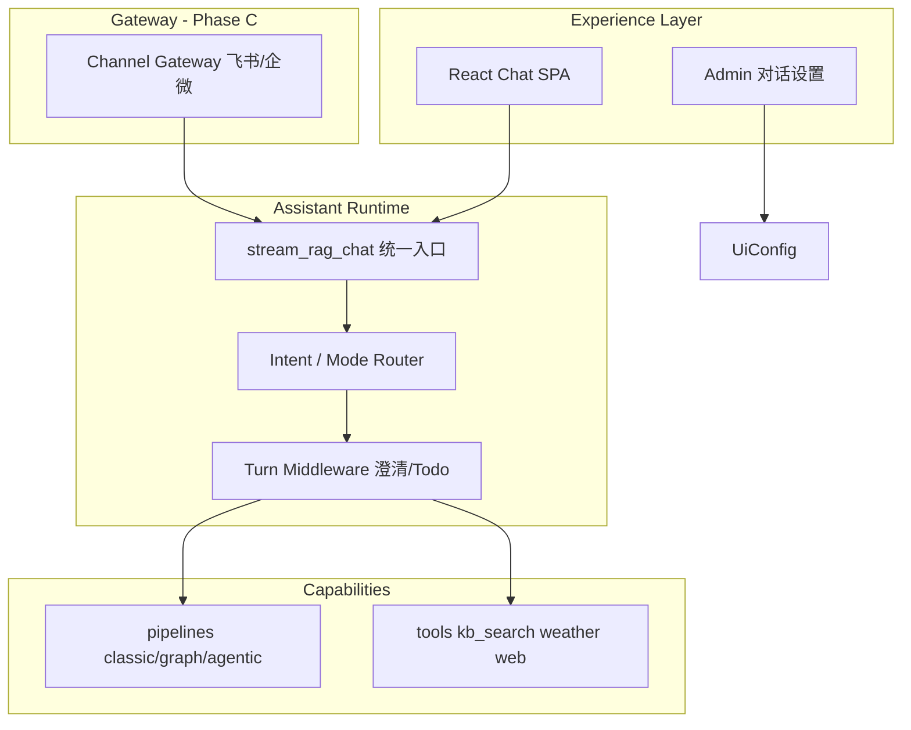

# Assistant 融合实施计划（RAG + 任务 Agent + 多端）

> 目标：一个产品 —— **能问知识库，也能帮你完成任务**；DeerFlow 借鉴 **界面与编排形态**，不替换现有 RAG 内核与 ACL。  
> **起点：界面融合（Phase A）**，再逐步扩展编排与渠道。

---

## 1. 产品形态

| 用户模式 | 说明 | 默认行为 |
|----------|------|----------|
| **知识** `knowledge` | 问制度、课程、内部文档 | KB 优先、有引用、低延迟 |
| **任务** `task` | 多步办事、查+写+工具 | ReAct + 全工具 + agentic 检索 |
| **自动** `auto` | 系统按意图路由 | 规则 + 可选小模型（Phase B） |

同一 **会话 / thread**、同一 **ToolTrace 时间线**、同一 **SSE 协议**；模式可 per-session 或 per-message 覆盖。

---

## 2. 目标架构



**代码边界（同 repo，逻辑分离）：**

```text
enterprise_rag/src/agent/
  runtime/           # 模式路由、middleware（Phase B 起）
  pipelines/         # RAG 检索内核（少动）
  tools/             # 工具注册与执行
  stream_chat.py     # 唯一对外编排入口

channel_gateway/     # Phase C 新建，调 /chat/stream

frontend/src/
  components/chat/   # 界面融合主战场
  lib/assistantMode.ts
```

---

## 3. 核心接口设计

### 3.1 助手模式枚举

```typescript
// frontend/src/lib/assistantMode.ts
export type AssistantMode = "knowledge" | "task" | "auto";

export type AssistantModeOption = {
  id: AssistantMode;
  label: string;
  description: string;
};

export const ASSISTANT_MODE_OPTIONS: AssistantModeOption[] = [
  { id: "knowledge", label: "知识", description: "优先知识库，回答带引用" },
  { id: "task", label: "任务", description: "多步推理与工具，帮你完成事项" },
  { id: "auto", label: "自动", description: "按问题自动选择知识或任务" },
];
```

```python
# enterprise_rag/src/agent/runtime/modes.py
AssistantMode = Literal["knowledge", "task", "auto"]

@dataclass(frozen=True)
class ModeProfile:
    hybrid_expert_mode: bool
    rag_architecture: str          # auto | classic | graph | agentic
    agent_reasoning_mode: str      # direct | react | plan
    tools_enabled: bool
    stream_fast_mode: bool
    clarify_enabled: bool          # Phase B
    plan_mode: bool                # Phase B
```

**模式 → 运行时映射（Phase A 纯规则，无 LLM）：**

| mode | hybrid_expert | rag_architecture | reasoning | tools | stream_fast |
|------|---------------|------------------|-----------|-------|-------------|
| knowledge | false | auto | direct | 关* | true |
| task | true | agentic | react | 开 | false |
| auto | 跟 ui_config | auto | 跟 ui_config | 跟 ui_config | 跟 ui_config |

\* 知识模式默认关通用工具；实时类问题（天气/时间）Phase A 仍走现有 realtime tool 检测。

---

### 3.2 HTTP API 扩展

#### `ChatRequest` / `StreamPayload` 新增字段

```python
# enterprise_rag/src/api/schemas.py
assistant_mode: str | None = Field(
    default=None,
    pattern="^(knowledge|task|auto)$",
    description="助手模式；None 使用会话默认或服务端 UI 默认",
)
```

```typescript
// frontend/src/api/types.ts — StreamPayload
assistant_mode?: "knowledge" | "task" | "auto";
```

#### 会话级默认模式（Phase A 可选：仅 localStorage；Phase A2：持久化）

```python
# GET/PATCH 扩展（Phase A2）
# GET /chat/sessions?user_id=
class ChatSessionPublic(BaseModel):
    id: str
    title: str
    updated_at: str
    assistant_mode: str = "auto"   # 新增

# PATCH /chat/sessions/{id}
class ChatSessionPatch(BaseModel):
    title: str | None = None
    assistant_mode: str | None = None
```

#### UI 配置公开字段

```python
# ui_config 新增（Admin Memory 页或场景页配置）
default_assistant_mode: str = "auto"
assistant_modes_enabled: list[str] = ["knowledge", "task", "auto"]
task_mode_tools_allowlist: list[str] | None = None  # None = 全部内置工具
```

```typescript
// UiConfig
default_assistant_mode?: AssistantMode;
assistant_modes_enabled?: AssistantMode[];
```

---

### 3.3 SSE 流式事件（现有 + 扩展）

**Phase A：沿用现有，增加 `status` 字段**

```typescript
type StreamEvent =
  | { type: "status"; phase: string; assistant_mode?: AssistantMode; ... }
  | { type: "token"; content: string }
  | { type: "tool_call"; tool: string; arguments: Record<string, unknown> }
  | { type: "tool_result"; tool: string; output: string; ok: boolean }
  | { type: "graph_viz"; graph: GraphViz }
  | { type: "done"; assistant_mode?: AssistantMode; ... }
  // Phase B 新增：
  | { type: "todo"; items: TodoItem[]; updated_at?: string }
  | { type: "clarify"; question: string; options?: string[]; clarify_id: string }
  | { type: "artifact"; name: string; mime: string; url_or_content: string };
```

```typescript
export type TodoItem = {
  id: string;
  content: string;
  status: "pending" | "in_progress" | "done" | "cancelled";
};

export type ExecutionStep = {
  id: string;
  kind: "status" | "tool" | "todo" | "clarify";
  label: string;
  ts?: number;
  detail?: string;
  ok?: boolean;
};
```

**Phase A 前端**：由 `status` + `tool_call/result` 合成 `ExecutionTimeline`，无需等新 SSE type。

---

### 3.4 消息 Meta 扩展

```typescript
// ChatMessage.meta 新增
assistant_mode?: AssistantMode;
execution_summary?: {
  steps: number;
  tools_used: string[];
  rag_architecture?: string;
  answer_mode?: string;
};
todos?: TodoItem[];           // Phase B
pending_clarify_id?: string;  // Phase B
```

---

### 3.5 内部 Python 接口（Phase B 编排层）

```python
# enterprise_rag/src/agent/runtime/router.py
def resolve_mode_profile(
    *,
    assistant_mode: str | None,
    ui_config: dict[str, Any],
    message: str,
) -> ModeProfile: ...

# enterprise_rag/src/agent/runtime/middleware.py
class TurnMiddleware(Protocol):
    def before_turn(self, state: dict[str, Any]) -> dict[str, Any]: ...
    def after_tool(self, state: dict[str, Any], tool: str, result: str) -> dict[str, Any]: ...
```

```python
# channel_gateway/backends/rag.py — Phase C
class RagBackend:
    async def stream_chat(self, payload: dict) -> AsyncIterator[str]: ...
    # 内部 POST /chat/stream，assistant_mode 透传
```

---

## 4. 界面设计（DeerFlow 借鉴映射）

| DeerFlow 元素 | 本项目组件 | Phase |
|---------------|------------|-------|
| 模式/Profile 切换 | `AssistantModeSwitcher` | A |
| 工具时间线 | `ExecutionTimeline`（升级 ToolTracePanel） | A |
| 任务 Todo 列表 | `TodoPanel` | B |
| 澄清卡片 | `ClarificationCard` | B |
| 产物区 | `ArtifactsPanel` | B |
| 线程侧栏标签 | `SessionList` mode badge | A2 |
| Skills slash | `ChatInput` `/` 命令 | B |

**Chat 页布局（Phase A）：**

```text
┌──────── SessionList ────────┬── ChatHeader (AssistantModeSwitcher) ──┐
│                           ├── MessageList ───────────────────────────│
│                           ├── ExecutionTimeline (streaming)          │
│                           ├── ChatToolbar (保留混合专家/新话题)       │
│                           └── ChatInput                              │
└───────────────────────────┴────────────────────────────────────────┘
```

---

## 5. 全项目文件清单（按阶段）

### Phase A — 界面融合（起点，约 2–3 周）

| 动作 | 路径 | 说明 |
|------|------|------|
| 新增 | `frontend/src/lib/assistantMode.ts` | 模式枚举、映射、localStorage key |
| 新增 | `frontend/src/components/chat/AssistantModeSwitcher.tsx` | 知识/任务/自动 分段控件 |
| 新增 | `frontend/src/components/chat/ExecutionTimeline.tsx` | 统一步骤时间线 |
| 新增 | `frontend/src/lib/executionTimeline.ts` | 从 StreamEvent 聚合 steps |
| 修改 | `frontend/src/components/chat/ToolTracePanel.tsx` | 复用 row 或委托 Timeline |
| 修改 | `frontend/src/components/chat/ChatToolbar.tsx` | 插入 ModeSwitcher 或拆 ChatHeader |
| 修改 | `frontend/src/pages/ChatPage.tsx` | 模式 state、payload、timeline |
| 修改 | `frontend/src/api/types.ts` | `assistant_mode`、ExecutionStep |
| 修改 | `frontend/src/api/client.ts` | streamChat 传 assistant_mode |
| 修改 | `enterprise_rag/src/api/schemas.py` | `ChatRequest.assistant_mode` |
| 新增 | `enterprise_rag/src/agent/runtime/__init__.py` | |
| 新增 | `enterprise_rag/src/agent/runtime/modes.py` | ModeProfile + resolve |
| 新增 | `enterprise_rag/src/agent/runtime/router.py` | mode → 运行时参数 |
| 修改 | `enterprise_rag/src/api/main.py` | chat/chat_stream 应用 router |
| 修改 | `enterprise_rag/src/agent/stream_chat.py` | 接收 resolved profile（透传 mem） |
| 修改 | `enterprise_rag/src/api/ui_config_store.py` | default_assistant_mode |
| 修改 | `frontend/src/pages/admin/MemoryPage.tsx` | 默认模式 Admin 配置 |
| 新增 | `frontend/tests/assistantMode.test.ts` | 映射单测 |
| 新增 | `frontend/tests/ExecutionTimeline.test.tsx` | 时间线渲染 |
| 新增 | `tests/test_assistant_mode_router.py` | 后端 mode 映射 |
| 修改 | `README.md` | 已实现功能表 + assistant_mode |

### Phase A2 — 会话持久化模式（约 1 周）

| 动作 | 路径 |
|------|------|
| 修改 | `enterprise_rag/src/api/chat_session_store.py` | 列 `assistant_mode` |
| 修改 | `enterprise_rag/src/api/schemas.py` | ChatSessionPublic + Patch |
| 修改 | `frontend/src/components/chat/SessionList.tsx` | 模式角标 |
| 修改 | `frontend/src/api/client.ts` | patchSession |

### Phase B — 编排融合（约 3–4 周）

| 动作 | 路径 |
|------|------|
| 新增 | `enterprise_rag/src/agent/tools/builtins/todos.py` | write_todos / read_todos |
| 新增 | `enterprise_rag/src/agent/tools/builtins/clarify.py` | ask_clarification |
| 新增 | `enterprise_rag/src/agent/runtime/middleware.py` | TurnMiddleware 链 |
| 新增 | `enterprise_rag/src/agent/runtime/todo_middleware.py` | |
| 新增 | `enterprise_rag/src/agent/runtime/clarify_middleware.py` | |
| 修改 | `enterprise_rag/src/agent/stream_chat.py` | 挂 middleware |
| 新增 | `frontend/src/components/chat/TodoPanel.tsx` | |
| 新增 | `frontend/src/components/chat/ClarificationCard.tsx` | |
| 新增 | `frontend/src/lib/streamTodos.ts` | SSE todo 事件 |
| 修改 | `frontend/src/lib/streamTools.ts` | 合并 todo/clarify |
| 新增 | `enterprise_rag/src/agent/skills/` | slash → scene_preset（可选） |

### Phase C — 渠道多端（约 4–6 周）

| 动作 | 路径 |
|------|------|
| 新增 | `channel_gateway/__init__.py` | |
| 新增 | `channel_gateway/message_bus.py` | 自 DeerFlow 瘦身拷贝 |
| 新增 | `channel_gateway/base.py` | Channel ABC |
| 新增 | `channel_gateway/manager.py` | RagBackend 替代 langgraph_sdk |
| 新增 | `channel_gateway/backends/rag.py` | |
| 新增 | `channel_gateway/adapters/feishu.py` | 首个渠道 |
| 新增 | `channel_gateway/store.py` | external_id → user_id |
| 修改 | `enterprise_rag/src/api/main.py` | 挂载 webhook 或独立进程 |
| 新增 | `frontend/src/pages/admin/ChannelsPage.tsx` | 绑定管理 |
| 新增 | `scripts/run-channel-gateway.ps1` | |
| 新增 | `docs/channel_integration.md` | |

### Phase D — 深度 Agent（按需）

| 动作 | 路径 |
|------|------|
| 新增 | `enterprise_rag/src/agent/subagents/` | 检索/写作子 agent |
| 新增 | `enterprise_rag/src/agent/runtime/memory_queue.py` | 跨会话记忆 |
| 新增 | `frontend/src/components/chat/ArtifactsPanel.tsx` | |

---

## 6. Phase A 分步实现（逐步提交）

每一步：**先测试 → 再实现 → 再 UI 接线**（TDD）。

### Step A1 — 契约与模式映射（后端，无 UI）

**目标：** `assistant_mode` 字段端到端可用，Chat 行为随模式变化。

1. `tests/test_assistant_mode_router.py` — knowledge/task/auto 映射断言
2. `agent/runtime/modes.py` + `router.py`
3. `schemas.py` 增加 `assistant_mode`
4. `main.py` 在 `_build_stream_state` 前调用 `resolve_mode_profile`
5. `pytest tests/test_assistant_mode_router.py -q`

**验收：**  
`POST /chat/stream` 带 `"assistant_mode":"knowledge"` 时 `hybrid_expert_mode=false`；`task` 时走 agentic + tools。

---

### Step A2 — 前端类型与 API

1. `assistantMode.ts` + 单测
2. `types.ts` / `client.ts` 增加字段
3. 暂不改 UI，用现有 Chat 在 devtools 手动改 payload 验证

---

### Step A3 — AssistantModeSwitcher UI

1. `AssistantModeSwitcher.tsx` — 三档 segmented control
2. `ChatPage` 顶栏：模式 state（默认 `uiConfig.default_assistant_mode ?? "auto"`）
3. localStorage `jnao_assistant_mode` 记住用户上次选择
4. `assistantMode.test.ts` + 快照/交互测试

**验收：** 切换模式后发送，Network 里 `assistant_mode` 正确。

---

### Step A4 — ExecutionTimeline（DeerFlow 式轨迹）

1. `executionTimeline.ts` — 聚合 `status` / `tool_call` / `tool_result`
2. `ExecutionTimeline.tsx` — 折叠面板，streaming 时展开
3. `ChatPage` 流式回调里维护 `executionSteps`
4. `MessageBubble` 历史消息展示 `meta.execution_summary` 或折叠 trace
5. `ExecutionTimeline.test.tsx`

**验收：** 任务模式下可见「检索 → 工具 → 生成」步骤；知识模式步骤更少。

---

### Step A5 — Admin 默认模式 + 文档

1. `ui_config_store` + MemoryPage 增加默认 assistant_mode
2. `README.md` 更新
3. 全量 `pytest` + `npm test` 相关文件

---

### Step A6 — 打磨（可选同 PR）

- 知识/任务 **占位提示语**（ChatInput placeholder）
- **建议问题**按模式切换（`uiConfig.suggested_questions_task`）
- 模式切换时 toast 说明

---

## 7. 测试策略

| 层 | 内容 |
|----|------|
| 单元 | `resolve_mode_profile`、executionTimeline 聚合 |
| API | `/chat/stream` assistant_mode 影响 answer_mode / tool_trace |
| 前端 | Switcher、Timeline、ChatPage 集成（mock stream） |
| E2E（后期） | Playwright：切任务模式 → 出现 tool 步骤 |

---

## 8. 与 DeerFlow 的关系（避免重复建设）

| 采纳 | 不采纳 |
|------|--------|
| 模式切换 UX、执行时间线、Todo/澄清 UI 模式 | 整包 deerflow-harness |
| Channel adapter 模式（Phase C） | DeerFlow Next.js 前端 |
| Middleware **思想**（Phase B 自研薄层） | Sandbox/bash（初期） |

---

## 9. 分支建议

```text
feature/assistant-fusion-ui     # Phase A
feature/assistant-fusion-orchestration  # Phase B
feature/channel-gateway-feishu  # Phase C
```

每个 Step 一个 commit，便于 review：

```text
feat(assistant): add mode router and ChatRequest.assistant_mode
feat(frontend): add AssistantModeSwitcher
feat(frontend): add ExecutionTimeline for chat stream
feat(admin): default assistant mode in ui config
```

---

## 10. 下一步（立即执行）

**当前迭代只做 Step A1 + A2 + A3**（契约 + 模式切换 UI），A4 Timeline 紧随其后。

执行顺序见 [§6 Phase A 分步实现](#6-phase-a-分步实现逐步提交)。

---

## 附录 A — curl 示例

```bash
# 知识模式
curl -N -X POST "http://127.0.0.1:8010/chat/stream" \
  -H "Content-Type: application/json" \
  -d '{
    "message": "1-3年级超脑阅读要求是什么？",
    "user_id": "u1",
    "user_department": "技术部",
    "assistant_mode": "knowledge",
    "session_id": "s1"
  }'

# 任务模式
curl -N -X POST "http://127.0.0.1:8010/chat/stream" \
  -H "Content-Type: application/json" \
  -d '{
    "message": "查知识库里阅读训练要点，整理成三条行动建议",
    "user_id": "u1",
    "user_department": "技术部",
    "assistant_mode": "task",
    "session_id": "s1"
  }'
```

## 附录 B — 现有代码挂点速查

|  Concern | 文件 |
|----------|------|
| 流式入口 | `enterprise_rag/src/api/main.py` → `chat_stream` |
| 编排主链 | `enterprise_rag/src/agent/stream_chat.py` |
| 工具循环 | `enterprise_rag/src/agent/tools/runtime/loop.py` |
| 前端发送 | `frontend/src/pages/ChatPage.tsx` → `handleSend` |
| 工具 trace UI | `frontend/src/components/chat/ToolTracePanel.tsx` |
| UI 配置 | `enterprise_rag/src/api/ui_config_store.py` |
