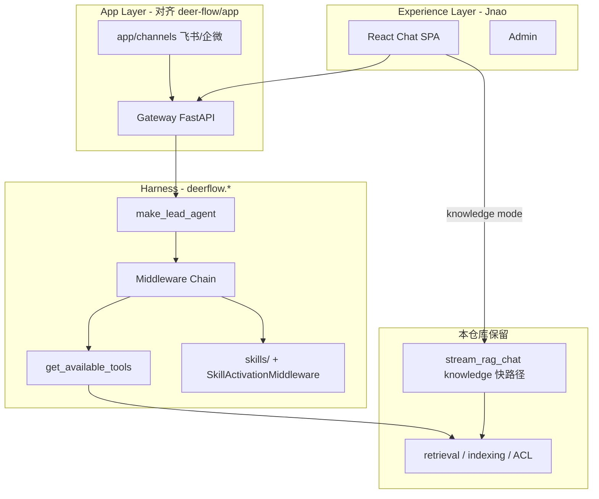

# Assistant 融合实施计划（RAG + DeerFlow Agent + 多端）

> **实现唯一依据**：[`docs/deerflow-integration.md`](./deerflow-integration.md) + 本地源码 `D:\bytedance flow\deer-flow`  
> **禁止**自研平行 Agent 架构（自研 ReAct 主链、自研 Skill 格式、自研 Token 聚合、自研渠道总线）。  
> **目标**：一个产品 —— **能问知识库，也能帮你完成任务**；编排层 **严格按 DeerFlow Harness/App 分层**，RAG/ACL 仅作 **community 工具 + KB 快路径** 适配。  
> **北极星**：Agent **准确理解意图**、**准确调用工具**（Skill + `get_available_tools` + Middleware）、**可观测**（TokenUsage）、**可多端**（channels）。

---

## 0. 改动原则（DeerFlow 为准 + 前后端分工）

| 能力 | 实现来源（DeerFlow） | 前端 UI |
|------|---------------------|---------|
| **工具层** | `deerflow.tools.get_available_tools` + `config.yaml` + MCP | ❌（Admin 沿用 DeerFlow `/api/mcp` 或现有工具页） |
| **Skill 层** | `skills/**/SKILL.md` + `SkillActivationMiddleware` | ⚠️ Chat `/` 提示（与 DeerFlow 一致） |
| **Middleware** | `build_lead_runtime_middlewares` + `build_middlewares` | ❌ |
| **Token** | `TokenUsageMiddleware` + `GET /api/threads/{id}/token-usage` | ✅ **对齐** `deer-flow/frontend/src/core/messages/usage.ts` |
| **渠道** | `app/channels/*` + `GET /api/channels/` | ✅ **Admin ChannelsPage**（字段同 DeerFlow） |
| **KB 快路径** | 本仓库 `stream_rag_chat`（仅 knowledge 模式） | 现有 Chat |

**Code Review 硬规则**：见 [`deerflow-integration.md` §9](./deerflow-integration.md#9-禁止清单code-review-硬规则)。

---

## 1. 产品形态

| 用户模式 | 说明 | 默认行为 |
|----------|------|----------|
| **知识** `knowledge` | 问制度、课程、内部文档 | KB 优先、有引用、低延迟 |
| **任务** `task` | 多步办事、查+写+工具 | **`make_lead_agent` + LangGraph**（DeerFlow 主链） |
| **自动** `auto` | 系统按意图路由 | knowledge 快路径 **或** DeerFlow 主链（按 ModeProfile） |

同一 **会话 / thread**、同一 **ToolTrace 时间线**、同一 **SSE 协议**；模式可 per-session 或 per-message 覆盖。

---

## 2. 目标架构



**代码边界（DeerFlow Harness / App 拆分）：**

```text
# 引入（与 D:\bytedance flow\deer-flow 同构）
backend/packages/harness/deerflow/     # import deerflow.*
config.yaml                          # 模型、tools、sandbox、token_usage
extensions_config.json               # MCP + skills enabled
skills/public|custom/**/SKILL.md

# 本仓库 App 适配
enterprise_rag/src/api/                # Gateway 扩展（挂载 deerflow routers）
enterprise_rag/src/app/channels/       # 自 deer-flow/app/channels 适配
enterprise_rag/src/deerflow_community/ # kb_search 等 RAG 工具（config.yaml use:）
enterprise_rag/src/agent/stream_chat.py  # 仅 knowledge 快路径
enterprise_rag/src/retrieval|indexing|security/  # 不变

frontend/src/
  core/messages/usage.ts               # 自 deer-flow 移植 Token UI
  core/threads/token-usage.ts
  pages/admin/ChannelsPage.tsx
  pages/admin/SkillsPage.tsx           # 对齐 /api/skills
```

### 2.1 编排北极星（DeerFlow 主链）

```text
用户消息
  → assistant_mode：knowledge → stream_rag_chat（KB 快路径，现有）
  → assistant_mode：task|auto → make_lead_agent(config)
       → build_lead_runtime_middlewares（ToolOutputBudget、Sandbox…）
       → SkillActivationMiddleware（/skill-name）
       → DynamicContextMiddleware（日期/上下文）
       → get_available_tools（config.yaml + MCP + builtins）
       → ClarificationMiddleware / TodoMiddleware / TokenUsageMiddleware
       → LangGraph SSE（messages-tuple + usage_metadata）
```

**意图与工具准确性**由 DeerFlow 机制保证：`Skill.md` 工作流、`allowed-tools`、`ask_clarification_tool`、community `web_search`（Tavily），**不得**用自研 `routing.py` 替代 task/auto 主路径（routing 仅 KB 快路径辅助，见 integration 文档 §3.4）。

---

## 3. 核心接口设计

### 3.1 助手模式枚举

```typescript
// frontend/src/lib/assistantMode.ts
export type AssistantMode = "knowledge" | "task" | "auto";

export type AssistantModeOption = {
  id: AssistantMode;
  label: string;
  description: string;
};

export const ASSISTANT_MODE_OPTIONS: AssistantModeOption[] = [
  { id: "knowledge", label: "知识", description: "优先知识库，回答带引用" },
  { id: "task", label: "任务", description: "多步推理与工具，帮你完成事项" },
  { id: "auto", label: "自动", description: "按问题自动选择知识或任务" },
];
```

```python
# enterprise_rag/src/agent/runtime/modes.py
AssistantMode = Literal["knowledge", "task", "auto"]

@dataclass(frozen=True)
class ModeProfile:
    hybrid_expert_mode: bool
    rag_architecture: str          # auto | classic | graph | agentic
    agent_reasoning_mode: str      # direct | react | plan
    tools_enabled: bool
    stream_fast_mode: bool
    clarify_enabled: bool          # Phase B
    plan_mode: bool                # Phase B
```

**模式 → 运行时映射（Phase A 纯规则，无 LLM）：**

| mode | hybrid_expert | rag_architecture | reasoning | tools | stream_fast |
|------|---------------|------------------|-----------|-------|-------------|
| knowledge | false | auto | direct | 关* | true |
| task | true | agentic | react | 开 | false |
| auto | 跟 ui_config | auto | 跟 ui_config | 跟 ui_config | 跟 ui_config |

\* 知识模式默认关通用工具；实时类问题（天气/时间）Phase A 仍走现有 realtime tool 检测。

---

### 3.2 HTTP API 扩展

#### `ChatRequest` / `StreamPayload` 新增字段

```python
# enterprise_rag/src/api/schemas.py
assistant_mode: str | None = Field(
    default=None,
    pattern="^(knowledge|task|auto)$",
    description="助手模式；None 使用会话默认或服务端 UI 默认",
)
```

```typescript
// frontend/src/api/types.ts — StreamPayload
assistant_mode?: "knowledge" | "task" | "auto";
```

#### 会话级默认模式（Phase A 可选：仅 localStorage；Phase A2：持久化）

```python
# GET/PATCH 扩展（Phase A2）
# GET /chat/sessions?user_id=
class ChatSessionPublic(BaseModel):
    id: str
    title: str
    updated_at: str
    assistant_mode: str = "auto"   # 新增

# PATCH /chat/sessions/{id}
class ChatSessionPatch(BaseModel):
    title: str | None = None
    assistant_mode: str | None = None
```

#### UI 配置公开字段

```python
# ui_config 新增（Admin Memory 页或场景页配置）
default_assistant_mode: str = "auto"
assistant_modes_enabled: list[str] = ["knowledge", "task", "auto"]
task_mode_tools_allowlist: list[str] | None = None  # None = 全部内置工具
```

```typescript
// UiConfig
default_assistant_mode?: AssistantMode;
assistant_modes_enabled?: AssistantMode[];
```

---

### 3.3 SSE 流式事件（现有 + 扩展）

**Phase A：沿用现有，增加 `status` 字段**

```typescript
type StreamEvent =
  | { type: "status"; phase: string; assistant_mode?: AssistantMode; ... }
  | { type: "token"; content: string }
  | { type: "tool_call"; tool: string; arguments: Record<string, unknown> }
  | { type: "tool_result"; tool: string; output: string; ok: boolean }
  | { type: "graph_viz"; graph: GraphViz }
  | { type: "done"; assistant_mode?: AssistantMode; ... }
  // Phase B 新增：
  | { type: "todo"; items: TodoItem[]; updated_at?: string }
  | { type: "clarify"; question: string; options?: string[]; clarify_id: string }
  | { type: "artifact"; name: string; mime: string; url_or_content: string };
```

```typescript
export type TodoItem = {
  id: string;
  content: string;
  status: "pending" | "in_progress" | "done" | "cancelled";
};

export type ExecutionStep = {
  id: string;
  kind: "status" | "tool" | "todo" | "clarify";
  label: string;
  ts?: number;
  detail?: string;
  ok?: boolean;
};
```

**Phase A 前端**：由 `status` + `tool_call/result` 合成 `ExecutionTimeline`，无需等新 SSE type。

---

### 3.4 消息 Meta 扩展

```typescript
// ChatMessage.meta 新增
assistant_mode?: AssistantMode;
execution_summary?: {
  steps: number;
  tools_used: string[];
  rag_architecture?: string;
  answer_mode?: string;
};
todos?: TodoItem[];           // Phase B
pending_clarify_id?: string;  // Phase B
```

---

### 3.5 内部 Python 接口（Phase B 编排层）

```python
# enterprise_rag/src/agent/runtime/router.py
def resolve_mode_profile(
    *,
    assistant_mode: str | None,
    ui_config: dict[str, Any],
    message: str,
) -> ModeProfile: ...

# enterprise_rag/src/agent/runtime/middleware.py
class TurnMiddleware(Protocol):
    def before_turn(self, state: dict[str, Any]) -> dict[str, Any]: ...
    def after_tool(self, state: dict[str, Any], tool: str, result: str) -> dict[str, Any]: ...
```

```python
# channel_gateway/backends/rag.py — Phase C
class RagBackend:
    async def stream_chat(self, payload: dict) -> AsyncIterator[str]: ...
    # 内部 POST /chat/stream，assistant_mode 透传
```

---

## 4. 界面设计（DeerFlow 借鉴映射）

| DeerFlow 元素 | 本项目组件 | Phase |
|---------------|------------|-------|
| 模式/Profile 切换 | `AssistantModeSwitcher` | A |
| 工具时间线 | `ExecutionTimeline`（升级 ToolTracePanel） | A |
| 任务 Todo 列表 | `TodoPanel` | B |
| 澄清卡片 | `ClarificationCard` | B |
| 产物区 | `ArtifactsPanel` | B |
| 线程侧栏标签 | `SessionList` mode badge | A2 |
| Skills slash | `ChatInput` `/` 命令 | B |

**Chat 页布局（Phase A）：**

```text
┌──────── SessionList ────────┬── ChatHeader (AssistantModeSwitcher) ──┐
│                           ├── MessageList ───────────────────────────│
│                           ├── ExecutionTimeline (streaming)          │
│                           ├── ChatToolbar (保留混合专家/新话题)       │
│                           └── ChatInput                              │
└───────────────────────────┴────────────────────────────────────────┘
```

---

## 5. 全项目文件清单（按阶段）

### Phase A — 界面融合（起点，约 2–3 周）

| 动作 | 路径 | 说明 |
|------|------|------|
| 新增 | `frontend/src/lib/assistantMode.ts` | 模式枚举、映射、localStorage key |
| 新增 | `frontend/src/components/chat/AssistantModeSwitcher.tsx` | 知识/任务/自动 分段控件 |
| 新增 | `frontend/src/components/chat/ExecutionTimeline.tsx` | 统一步骤时间线 |
| 新增 | `frontend/src/lib/executionTimeline.ts` | 从 StreamEvent 聚合 steps |
| 修改 | `frontend/src/components/chat/ToolTracePanel.tsx` | 复用 row 或委托 Timeline |
| 修改 | `frontend/src/components/chat/ChatToolbar.tsx` | 插入 ModeSwitcher 或拆 ChatHeader |
| 修改 | `frontend/src/pages/ChatPage.tsx` | 模式 state、payload、timeline |
| 修改 | `frontend/src/api/types.ts` | `assistant_mode`、ExecutionStep |
| 修改 | `frontend/src/api/client.ts` | streamChat 传 assistant_mode |
| 修改 | `enterprise_rag/src/api/schemas.py` | `ChatRequest.assistant_mode` |
| 新增 | `enterprise_rag/src/agent/runtime/__init__.py` | |
| 新增 | `enterprise_rag/src/agent/runtime/modes.py` | ModeProfile + resolve |
| 新增 | `enterprise_rag/src/agent/runtime/router.py` | mode → 运行时参数 |
| 修改 | `enterprise_rag/src/api/main.py` | chat/chat_stream 应用 router |
| 修改 | `enterprise_rag/src/agent/stream_chat.py` | 接收 resolved profile（透传 mem） |
| 修改 | `enterprise_rag/src/api/ui_config_store.py` | default_assistant_mode |
| 修改 | `frontend/src/pages/admin/MemoryPage.tsx` | 默认模式 Admin 配置 |
| 新增 | `frontend/tests/assistantMode.test.ts` | 映射单测 |
| 新增 | `frontend/tests/ExecutionTimeline.test.tsx` | 时间线渲染 |
| 新增 | `tests/test_assistant_mode_router.py` | 后端 mode 映射 |
| 修改 | `README.md` | 已实现功能表 + assistant_mode |

### Phase A2 — 会话持久化模式（约 1 周）

| 动作 | 路径 |
|------|------|
| 修改 | `enterprise_rag/src/api/chat_session_store.py` | 列 `assistant_mode` |
| 修改 | `enterprise_rag/src/api/schemas.py` | ChatSessionPublic + Patch |
| 修改 | `frontend/src/components/chat/SessionList.tsx` | 模式角标 |
| 修改 | `frontend/src/api/client.ts` | patchSession |

### Phase B — DeerFlow 编排接入（DF-0 ~ DF-5，约 4–6 周）

> 逐步对照 [`deerflow-integration.md`](./deerflow-integration.md) §8；每 PR 附 DeerFlow 源文件路径。

#### B0 引入 Harness

| 动作 | DeerFlow 参照 |
|------|----------------|
| 引入 `deerflow-harness` | `D:\bytedance flow\deer-flow\backend\packages\harness` |
| 根目录 `config.yaml` | `deer-flow/config.example.yaml` |
| 根目录 `extensions_config.json` | DeerFlow 默认结构 |
| 边界测试 | `tests/test_harness_boundary.py` |

#### B1 工具层（`get_available_tools`）

| 动作 | DeerFlow 参照 |
|------|----------------|
| RAG 工具 | `enterprise_rag/src/deerflow_community/` → `config.yaml` `use:` |
| 联网搜索 | `deerflow.community.tavily.tools:web_search_tool` |
| MCP | `deerflow.mcp` + `extensions_config.json` |
| 废弃 | `agent/tools/runtime/loop.py` 不再作为 task/auto 主编排 |

#### B2 Skill 层

| 动作 | DeerFlow 参照 |
|------|----------------|
| 目录 | 仓库根 `skills/public|custom/**/SKILL.md` |
| 加载/激活 | `deerflow.skills.*` + `SkillActivationMiddleware` |
| Gateway | `app/gateway/routers/skills.py` |
| 业务迁移 | `wecom-parent-dm`、`industry-research` 两个 SKILL |

#### B3 Token（后端 + **前端展示**）

| 动作 | DeerFlow 参照 |
|------|----------------|
| 后端 | `TokenUsageMiddleware` + `config.yaml` → `token_usage.enabled` |
| API | `GET /api/threads/{thread_id}/token-usage` |
| Chat UI | `deer-flow/frontend/src/core/messages/usage.ts` |
| Thread UI | `deer-flow/frontend/src/core/threads/token-usage.ts` |

#### B4 Gateway 嵌入 Lead Agent

| 动作 | 说明 |
|------|------|
| task/auto | `make_lead_agent` + `RunManager` LangGraph SSE |
| knowledge | 保留 `stream_rag_chat` 快路径 |
| 路由 | `agent/runtime/modes.py` 选择路径 |

#### B5 澄清 / Todo UI

| 动作 | DeerFlow 参照 |
|------|----------------|
| 工具 | `ask_clarification_tool`、`TodoMiddleware` |
| 前端 | 解析 LangGraph 消息（非自研 SSE event type） |

### Phase C — DeerFlow 渠道（DF-6，约 3–4 周）

| 动作 | DeerFlow 参照 |
|------|----------------|
| 模块 | `app/channels/base.py`、`message_bus.py`、`manager.py`、`feishu.py` |
| Gateway | `app/gateway/routers/channels.py` |
| 前端 | `ChannelsPage.tsx` ← `ChannelStatusResponse` |
| 运行 | 渠道 worker → LangGraph-compatible runs API |

### Phase D — DeerFlow 子 Agent（按需）

| 动作 | DeerFlow 参照 |
|------|----------------|
| 子 Agent | `deerflow.subagents` + `task_tool`（`config.yaml` `subagent_enabled`） |
| 产物 | `present_file_tool` + `ArtifactsPanel`（对齐 DeerFlow artifacts 路由） |

---

## 6. Phase A 分步实现（逐步提交）

每一步：**先测试 → 再实现 → 再 UI 接线**（TDD）。

### Step A1 — 契约与模式映射（后端，无 UI）

**目标：** `assistant_mode` 字段端到端可用，Chat 行为随模式变化。

1. `tests/test_assistant_mode_router.py` — knowledge/task/auto 映射断言
2. `agent/runtime/modes.py` + `router.py`
3. `schemas.py` 增加 `assistant_mode`
4. `main.py` 在 `_build_stream_state` 前调用 `resolve_mode_profile`
5. `pytest tests/test_assistant_mode_router.py -q`

**验收：**  
`POST /chat/stream` 带 `"assistant_mode":"knowledge"` 时 `hybrid_expert_mode=false`；`task` 时走 agentic + tools。

---

### Step A2 — 前端类型与 API

1. `assistantMode.ts` + 单测
2. `types.ts` / `client.ts` 增加字段
3. 暂不改 UI，用现有 Chat 在 devtools 手动改 payload 验证

---

### Step A3 — AssistantModeSwitcher UI

1. `AssistantModeSwitcher.tsx` — 三档 segmented control
2. `ChatPage` 顶栏：模式 state（默认 `uiConfig.default_assistant_mode ?? "auto"`）
3. localStorage `jnao_assistant_mode` 记住用户上次选择
4. `assistantMode.test.ts` + 快照/交互测试

**验收：** 切换模式后发送，Network 里 `assistant_mode` 正确。

---

### Step A4 — ExecutionTimeline（DeerFlow 式轨迹）

1. `executionTimeline.ts` — 聚合 `status` / `tool_call` / `tool_result`
2. `ExecutionTimeline.tsx` — 折叠面板，streaming 时展开
3. `ChatPage` 流式回调里维护 `executionSteps`
4. `MessageBubble` 历史消息展示 `meta.execution_summary` 或折叠 trace
5. `ExecutionTimeline.test.tsx`

**验收：** 任务模式下可见「检索 → 工具 → 生成」步骤；知识模式步骤更少。

---

### Step A5 — Admin 默认模式 + 文档

1. `ui_config_store` + MemoryPage 增加默认 assistant_mode
2. `README.md` 更新
3. 全量 `pytest` + `npm test` 相关文件

---

### Step A6 — 打磨（可选同 PR）

- 知识/任务 **占位提示语**（ChatInput placeholder）
- **建议问题**按模式切换（`uiConfig.suggested_questions_task`）
- 模式切换时 toast 说明

---

## 7. 测试策略

| 层 | 内容 |
|----|------|
| 单元 | `resolve_mode_profile`、executionTimeline 聚合 |
| API | `/chat/stream` assistant_mode 影响 answer_mode / tool_trace |
| 前端 | Switcher、Timeline、ChatPage 集成（mock stream） |
| E2E（后期） | Playwright：切任务模式 → 出现 tool 步骤 |

---

## 8. 与 DeerFlow 的关系（严格对齐，非选择性借鉴）

**源码路径**：`D:\bytedance flow\deer-flow`  
**集成规范**：[`docs/deerflow-integration.md`](./deerflow-integration.md)

| 必须整模块对齐 | 本仓库唯一增量 |
|----------------|----------------|
| `deerflow-harness`（agents / tools / skills / mcp / runtime） | `deerflow_community` RAG 工具 |
| `config.yaml` + `extensions_config.json` | 部门 ACL 注入 kb 工具 |
| `skills/public|custom` + `SkillActivationMiddleware` | 业务 SKILL 内容 |
| `TokenUsageMiddleware` + thread token-usage API | Jnao 前端 UI 移植 |
| `app/channels/*` + `/api/channels` | 飞书/企微凭证与部门映射 |
| `make_lead_agent` + Middleware 链 | **knowledge** 模式 `stream_rag_chat` 快路径 |

**禁止**：自研 TurnMiddleware、自研 Skill loader、自研 token store、自研 `channel_gateway/` 包名与 DeerFlow 不同的总线。

### 8.1 能力对照

| 维度 | DeerFlow 实现 | 本仓库 |
|------|---------------|--------|
| 意图→工具 | Skill + `get_available_tools` + Middleware | **同左**（task/auto）；knowledge 走 KB 快路径 |
| 联网搜索 | `deerflow.community.tavily` | **同左**（config.yaml） |
| Skill | `LocalSkillStorage` + `/slash` | **同左** |
| Token | `TokenUsageMiddleware` + `/api/threads/.../token-usage` | **同左** + 前端 usage 模块 |
| 渠道 | `app/channels` + LangGraph runs | **同左** |
| RAG | — | `deerflow_community.kb_search` + 现有 indexing |

---

## 9. 分支建议

```text
feature/assistant-fusion-ui     # Phase A
feature/assistant-fusion-orchestration  # Phase B
feature/channel-gateway-feishu  # Phase C
```

每个 Step 一个 commit，便于 review：

```text
feat(assistant): add mode router and ChatRequest.assistant_mode
feat(frontend): add AssistantModeSwitcher
feat(frontend): add ExecutionTimeline for chat stream
feat(admin): default assistant mode in ui config
```

---

## 10. 下一步（执行顺序）

1. 阅读并锁定 [`deerflow-integration.md`](./deerflow-integration.md)  
2. **DF-0**：引入 harness + `config.yaml`  
3. **DF-1 ~ DF-3**：skills + deerflow_community 工具  
4. **DF-4**：task/auto → `make_lead_agent`  
5. **DF-5**：TokenUsage + 前端 usage 移植  
6. **DF-6**：`app/channels` + Admin ChannelsPage  

分支：`feature/deerflow-harness-integration`（B）、`feature/deerflow-channels`（C）。

Phase A 收尾与 Phase B **并行仅限文档/模式路由**；任何编排代码以 DeerFlow 模块为准。

---

## 附录 A — curl 示例

```bash
# 知识模式
curl -N -X POST "http://127.0.0.1:8010/chat/stream" \
  -H "Content-Type: application/json" \
  -d '{
    "message": "1-3年级超脑阅读要求是什么？",
    "user_id": "u1",
    "user_department": "技术部",
    "assistant_mode": "knowledge",
    "session_id": "s1"
  }'

# 任务模式
curl -N -X POST "http://127.0.0.1:8010/chat/stream" \
  -H "Content-Type: application/json" \
  -d '{
    "message": "查知识库里阅读训练要点，整理成三条行动建议",
    "user_id": "u1",
    "user_department": "技术部",
    "assistant_mode": "task",
    "session_id": "s1"
  }'
```

## 附录 B — 现有代码挂点速查

|  Concern | DeerFlow 参照 | 本仓库（过渡期） |
|----------|---------------|------------------|
| Lead Agent | `deerflow.agents.lead_agent.agent:make_lead_agent` | Phase B 接入 |
| 工具 | `deerflow.tools.get_available_tools` | `deerflow_community/`（规划） |
| Skill | `deerflow.skills` + `skills/` | Phase B |
| Token | `TokenUsageMiddleware` + `/api/threads/{id}/token-usage` | Phase B |
| 渠道 | `app/channels/` + `/api/channels/` | Phase C |
| KB 快路径 | — | `stream_chat.py`（knowledge only） |
| 集成规范 | — | `docs/deerflow-integration.md` |
