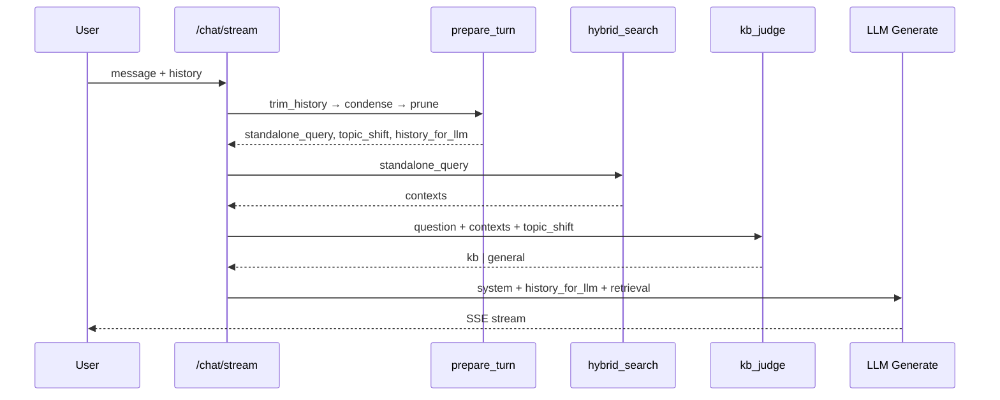

# 多轮对话上下文管理

> 目标：在同一会话窗口内，准确识别话题切换、截断无关历史、检索与生成解耦，并在可控延迟下提升多轮 RAG 质量。  
> 原则：热路径 LLM 调用次数可控；能向量算的不调 LLM；摘要等重活走异步。

---

## 一、问题与现状

| 现象 | 根因 |
|------|------|
| 换题后仍引用上一轮 KB 内容 | 生成阶段带入完整 `history`，无话题边界 |
| 指代追问检索不准 | 检索只用当前句，未做 standalone query |
| 长会话 token 膨胀 | 仅 FIFO 截断（轮数 + 字符），无语义筛选 |
| KB 与通用边界模糊 | 路由只看当前轮检索分，无 `topic_shift` 信号 |

**当前基线**（`agent/conversation_context.py`）：`max_history_turns` / `max_history_chars` 机械截断；检索与改写均不使用 history。

---

## 二、主流架构（四层）

```text
用户消息
  │
  ├─ L1 查询理解 ──► 换题判断 + 独立检索问句（standalone query）   [1× 小 LLM，可短路]
  │
  ├─ L2 检索 ──────► hybrid_search(standalone_query)              [不用 raw history]
  │
  ├─ L3 历史压缩 ──► embedding 剪枝 + 滚动摘要（异步）            [向量 / 后台]
  │
  └─ L4 路由 + 生成 ► kb_judge + 精简 history + 当前检索片段
```

与 LangChain `create_history_aware_retriever`、LlamaIndex `CondenseQuestionChatEngine` 同构。

---

## 三、模块结构

```text
enterprise_rag/src/agent/conversation/
├── __init__.py           # 对外导出
├── types.py              # TurnContext、CondenseResult 等类型
├── memory.py             # trim / resolve / build_llm_messages
├── query_condense.py     # Step 1：condense + topic_shift
├── history_prune.py      # Step 2：embedding 语义剪枝
├── prepare.py            # 编排 prepare_turn()
└── rolling_summary.py    # Step 3：滚动摘要（异步，待实现）
```

**兼容层**：`agent/conversation_context.py` 保留，re-export `memory` 模块符号，避免破坏现有 import。

---

## 四、分步实施

### Step 1 — Condense + 换题检测（L1）✅ 进行中

**职责**：在检索前产出 `standalone_query` 与 `topic_shift`。

| 字段 | 说明 |
|------|------|
| `standalone_query` | 可独立检索的完整问句（消解「它呢？」等指代） |
| `topic_shift` | `true` = 用户开启新话题，应清空进 LLM 的 history |
| `used_llm` | 是否调用了 LLM（可观测、可计费） |

**性能策略**

- 无 history → 直接返回原消息，零 LLM。
- 明显完整问句（长度 + 无指代词）→ 规则短路，零 LLM。
- 其余 → **一次** LLM，JSON 输出，合并换题 + 改写（禁止拆成两次调用）。

**检索**：`hybrid_search(standalone_query, skip_query_rewrite=True)`，避免与旧 `rewrite_query` 重复。

---

### Step 2 — Embedding 历史剪枝（L3 热路径）✅ 进行中

**职责**：`continue_topic` 时，只保留与 `standalone_query` 语义相近的历史轮次。

```text
embed(standalone_query)
embed(每条 user 内容) → cosine 相似度
保留 sim ≥ history_prune_min_similarity 的 (user, assistant) 对
再受 max_turns / max_chars 约束
```

**性能**：复用 `embed_texts` batch；`new_topic` 时跳过（history 已清空）。

---

### Step 3 — 滚动摘要（L3 异步）✅ 已实现

**职责**：每 N 轮且历史字符超阈值后，在 **`POST .../messages` 持久化完成后** 后台更新 `rolling_summary`。

```text
context = system + rolling_summary + pruned_history + retrieval + current
```

- 字段：`chat_sessions.rolling_summary`（SQLite，最长 4000 字）
- 任务：`refresh_rolling_summary_for_session`（FastAPI `BackgroundTasks`）
- 换题 / `reset_context`：调用 `clear_rolling_summary`

---

### Step 4 — 路由与生成解耦（L4）✅ 已实现

---

### Step 5 — 产品「新话题」✅ 已实现

Jnao Chat 输入框上方 **「新话题」** 按钮：下一条消息带 `reset_context=true` 且 `history=[]`。

---

## 五、热路径 LLM 预算

```text
每轮 /chat/stream（目标）:

  [可选 0次] 规则短路 condense
  [0–1次]    condense + topic_shift     ~100–200ms
  [已有]     kb_judge 边缘复核           ~50–100ms
  [已有]     检索 + rerank
  [已有]     生成

  [异步 0]   rolling_summary 更新
```

**禁止**：换题检测、rewrite、kb 相关性各调一次 LLM（3 次）。

### 路由模型与延迟档位

| 键 | 默认 | 说明 |
|----|------|------|
| `routing_model` | `""` | 预处理专用 model id；空 = 与回答模型相同 |
| `chat_routing_tier` | `balanced` | `fast` / `balanced` / `quality` |
| `condense_llm_enabled` | `true` | fast 档位自动关 |
| `kb_llm_judge_always` | `false` | quality 档位自动开 |

**档位行为**

| 档位 | condense LLM | kb LLM judge | 典型热路径 LLM 次数 |
|------|--------------|--------------|---------------------|
| fast | 关 | 关 | 0～1（仅生成） |
| balanced | 开（可短路） | 边缘 case | 0～2 + 生成 |
| quality | 开 | 检索命中也复核 | 1～2 + 生成 |

预处理模块：`agent/llm_routing.py`（`routing_model` 与 `chat_model` 分离）。

---

## 六、配置项

| 键 | 默认 | 说明 |
|----|------|------|
| `conversation_condense_enabled` | `true` | 启用 L1 condense |
| `history_prune_enabled` | `true` | 启用 L2 embedding 剪枝 |
| `history_prune_min_similarity` | `0.35` | 相似度阈值 |
| `history_prune_max_turns` | `4` | 剪枝后最多保留轮数 |
| `max_history_turns` | `6` | 全局历史上限（已有） |
| `rolling_summary_enabled` | `true` | 启用 L3 异步摘要 |
| `rolling_summary_every_n_turns` | `6` | 每 N 轮用户消息尝试更新 |
| `rolling_summary_min_chars` | `3500` | 历史总字符下限 |
| `reset_context`（请求） | `false` | 客户端「新话题」时为 `true` |

---

## 七、数据流（单轮）



---

## 八、验收指标

| 指标 | 方法 |
|------|------|
| 指代 recall@k | 多轮 golden set |
| 换题粘连率 | 人工标注 A→B 换题后是否仍引用 A |
| Latency P50/P95 | TTFB 相对基线（condense +200ms 内） |
| Context 体积 | 进 LLM 的 history 平均字符数 |
| LLM 调用次数 | `used_llm` / trace 统计 |

---

## 九、变更记录

| 日期 | 步骤 | 说明 |
|------|------|------|
| 2026-06-13 | Step 1–2 | 新增 `agent/conversation/`，`prepare_turn` 接入 `/chat` 与 `/chat/stream` |
| 2026-06-13 | 路由性能 | `routing_model` 分离、`chat_routing_tier`、开放题 KB 过滤、trace 字段 |
